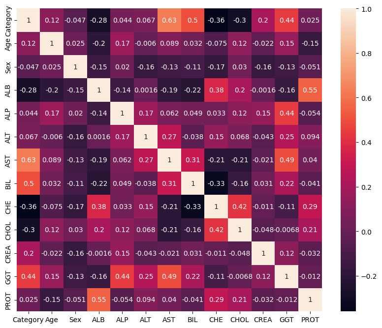
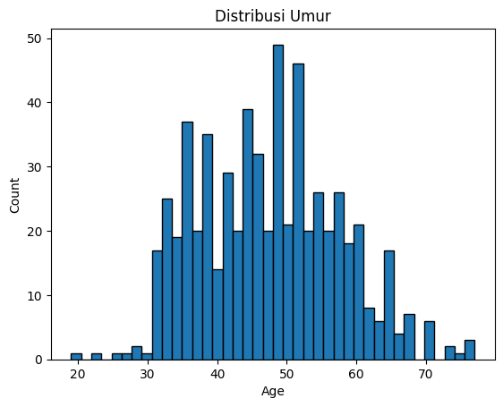
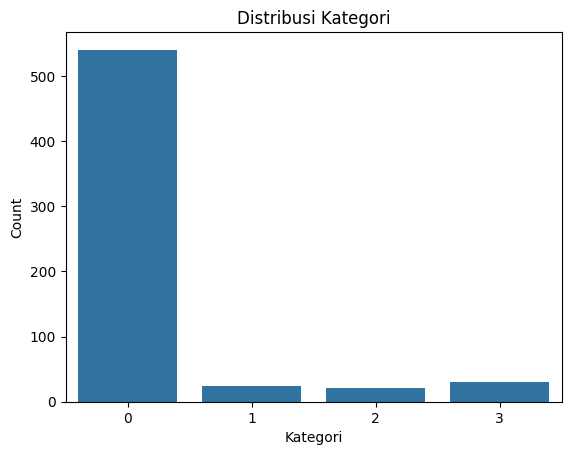
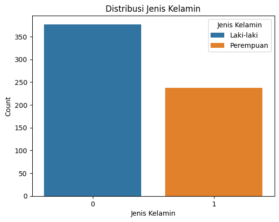

# Laporan Proyek Machine Learning

### Nama : Tugiyanto

### Nim : 211351146

### Kelas : Malam B

## Domain Proyek

Proyek ini berfokus pada prediksi penyakit Hepatitis C berdasarkan data pasien, termasuk faktor-faktor seperti usia, jenis kelamin, dan nilai-nilai laboratorium. Hepatitis C adalah penyakit hati yang dapat berkembang menjadi kondisi serius seperti fibrosis dan sirosis. Identifikasi dini dan klasifikasi pasien Hepatitis C adalah langkah awal untuk penanganan yang efektif. Pengetahuan tentang penyakit Hepatitis C sangat penting dalam bidang kedokteran dan kesehatan masyarakat.

## Business Understanding

### Problem Statements

- Bagaimana memprediksi kategori diagnosis pasien Hepatitis C?

- Bagaimana mengklasifikasikan pasien ke dalam kategori berbeda, seperti Blood Donor, Hepatitis, Fibrosis, dan Cirrhosis?

### Goals

- Mengembangkan model machine learning yang dapat memprediksi diagnosis pasien Hepatitis C dengan akurasi yang tinggi.

- Membuat alat yang dapat membantu tenaga medis dalam memahami status kesehatan pasien Hepatitis C.

## Data Understanding

Dataset yang digunakan bersumber dari [kaggle](https://www.kaggle.com/), link dataset bisa diakses via link dibawah ini :

[Hepatitis C Prediction Dataset](https://www.kaggle.com/datasets/fedesoriano/hepatitis-c-dataset)

Data yang digunakan dalam datasets ini berasal dari UCI Machine Learning Repository.

### Variabel-variabel pada Dataset adalah sebagai berikut:

- Age: Umur pasien dalam tahun. (int64)
- Sex: Jenis kelamin pasien (0 untuk laki-laki, 1 untuk perempuan). (object)
- ALB: Konsentrasi serum albumin. (float64)
- ALP: Fosfatase alkali. (float64)
- ALT: Enzim alanine transaminase. (float64)
- AST: Enzim aspartate aminotransferase. (float64)
- BIL: Bilirubin. (float64)
- CHE: Kolinesterase. (float64)
- CHOL: Kolesterol. (float64)
- CREA: Kreatinin. (float64)
- GGT: Gamma-glutamyl transferase. (float64)
- PROT: Protein total. (float64)
- Category: Kategori diagnosis pasien (0=Blood Donor, 0s=suspect Blood Donor, 1=Hepatitis, 2=Fibrosis, 3=Cirrhosis). (object )

## Data Preparation
disini saya akan menkoneksikan google colab menggunakan token dari akun saya :
```bash
from google.colab import files 
files.upload()
```

disini saya akan membuat direktori untuk penyimpanan file kaggle.json
```bash
!mkdir -p ~/.kaggle 
!cp kaggle.json ~/.kaggle/
!chmod 600 ~/.kaggle/kaggle.json
!ls ~/.kaggle
```
disini saya akan mendowload file datasetnya dari kaggle :
```bash
!kaggle datasets download -d fedesoriano/hepatitis-c-dataset
```
disini saya akan mengekstrak file dari dataset yang sudah saya download :
```bash
!unzip hepatitis-c-dataset.zip
```

Disini saya menggunakan beberapa library :

```bash
import pandas as pd
import numpy as np
import matplotlib.pyplot as plt
import seaborn as sns
```

setelah itu saya akan panggil dataset yang akan digunakan :

```bash
df = pd.read_csv('HepatitisCdata.csv')
```

setelah saya panggil dataset, saya akan melihat head dari dataset :

```bash
df.head()
```

saya juga akan mengecek tail dari dataset :

```bash
df.tail()
```

disini saya akan melihat tipe data apa saja yang digunakan :

```bash
df.info()
```

saya juga akan mengecek jumlah baris (rows) dan jumlah kolom (columns) dalam dataset :

```bash
df.shape
```

setelah itu saya mengecek ada berapa data null yang ada pada dataset :

```bash
df.isnull().sum()
```

saya mengganti nilai null dengan nilai mean :

```bash
df['ALB'].fillna(df['ALB'].mean(), inplace=True)
df['ALP'].fillna(df['ALP'].mean(), inplace=True)
df['CHOL'].fillna(df['CHOL'].mean(), inplace=True)
df['PROT'].fillna(df['PROT'].mean(), inplace=True)
df['ALT'].fillna(df['ALT'].mean(), inplace=True)
```

ada kolom yang tidak saya pakai, yaitu kolom "Unnamed: 0" , dan akan saya drop :

```bash
df.drop("Unnamed: 0",axis=1,inplace=True)
```

saya akan mengecek lagi apakah masih ada data yang null :

```bash
df.isnull().sum()
```

disini saya mengganti categorical menjadi numerik agar bisa diolah/ditrain :

```bash
df['Category'] = df['Category'].replace({
    '0=Blood Donor': 0,
    '0s=suspect Blood Donor': 0,
    '1=Hepatitis': 1,
    '2=Fibrosis': 2,
    '3=Cirrhosis': 3})

df['Sex'] = df['Sex'].replace({'m': 0, 'f': 1})
```

lalu saya akan mengecek head dan men'describe' dataset, setelah nilai kategorikal diubah numerik

```bash
df.head()
df.describe()
```

saya akan melihat heatmap dari dataset :

```bash
plt.figure(figsize=(10,8))
sns.heatmap(df.corr(),annot=True)
```



disini saya mengecek distribusi umur :

```bash
plt.hist(df['Age'], bins=40, edgecolor='black')
plt.title('Distribusi Umur')
plt.xlabel('Age')
plt.ylabel('Count')
plt.show()
```



saya juga mengecek distribusi kategori pasien :

```bash
sns.countplot(x='Category', data=df)

plt.title('Distribusi Kategori')
plt.xlabel('Kategori')
plt.ylabel('Count')

plt.show()
```



saya juga mengecek distribusi jenis kelamin :

```bash
sns.countplot(x='Sex', data=df, hue='Sex')

plt.title('Distribusi Jenis Kelamin')
plt.xlabel('Jenis Kelamin')
plt.ylabel('Count')

plt.legend(title='Jenis Kelamin', labels=['Laki-laki', 'Perempuan'])

plt.show()
```

)

## Modeling

pada tahap modeling saya akan menggunakan beberapa library dari scikit-learn, yaitu :

```bash
from sklearn.linear_model import LogisticRegression
from sklearn.model_selection import train_test_split
from sklearn.metrics import accuracy_score
```

lalu saya memasukkan fitur yang akan digunakan sebagai inputan dari pengguna :

```bash
features = ['Age', 'Sex', 'ALB', 'ALP', 'ALT', 'AST', 'BIL', 'CHE', 'CHOL', 'CREA', 'GGT', 'PROT']

x = df[features]
y = df['Category']
x.shape, y.shape
```

## Evaluation

metrik evaluasi yang digunakan adalah akurasi (accuracy).

disini saya membagi data uji, melatih model menggunakan data uji, dan menghitung akurasi :

```bash
X_train, X_test, y_train, y_test = train_test_split(x, y, test_size=0.2, random_state=10)

logistic_model = LogisticRegression()
logistic_model.fit(X_train, y_train)
predictions = logistic_model.predict(X_test)

accuracy = accuracy_score(y_test, predictions)
print("Akurasi prediksi: {:.2f}%".format(accuracy * 100))

# Output :
# Akurasi prediksi: 91.87%
```

output dari model yang sudah dilatih bisa di lihat, setelah menjalankan kode berikut :

```bash
input_data = np.array([[19, 1, 45, 80, 30, 25, 0.8, 16, 9, 199.5, 55, 44.80]])

prediction = logistic_model.predict(input_data)

if prediction[0] == 0:
    print('Pasien diprediksi sebagai Blood Donor.')
elif prediction[0] == 1:
    print('Pasien diprediksi sebagai Hepatitis.')
elif prediction[0] == 2:
    print('Pasien diprediksi sebagai Fibrosis.')
else:
    print('Pasien diprediksi sebagai Cirrhosis.')
```

## Deployment
[Prediksi HepatitisC](https://prediksihepatitisc-tugiyanto-malamb.streamlit.app/)

